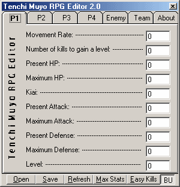



## Full comented Trainer \- Please Vote\!

### Description

Well I have searched PSC in search on how to make a trainer, but none of them where comented enough, to tell how to do it. So I made this so you can learn from it. It is easy basic trainer making code. But I am working on a SD3 one but it is going to be awhile before it is done. Since it has Virtualy everything changable to be changed. The Tenchi Muyo RPG is to be used when in battle.
 
### More Info
 

             |
---                |---
**Submitted On**   |2001-07-08 20:44:50
**By**             |[SadistBlue](https://github.com/Planet-Source-Code/PSCIndex/blob/master/ByAuthor/sadistblue.md)
**Level**          |Intermediate
**User Rating**    |4.6 (23 globes from 5 users)
**Compatibility**  |VB 3\.0, VB 4\.0 \(16\-bit\), VB 4\.0 \(32\-bit\), VB 5\.0, VB 6\.0
**Category**       |[Files/ File Controls/ Input/ Output](https://github.com/Planet-Source-Code/PSCIndex/blob/master/ByCategory/files-file-controls-input-output__1-3.md)
**World**          |[Visual Basic](https://github.com/Planet-Source-Code/PSCIndex/blob/master/ByWorld/visual-basic.md)
**Archive File**   |[Full comen22435782001\.zip](https://github.com/Planet-Source-Code/sadistblue-full-comented-trainer-please-vote__1-24836/archive/master.zip)

